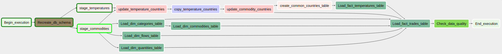
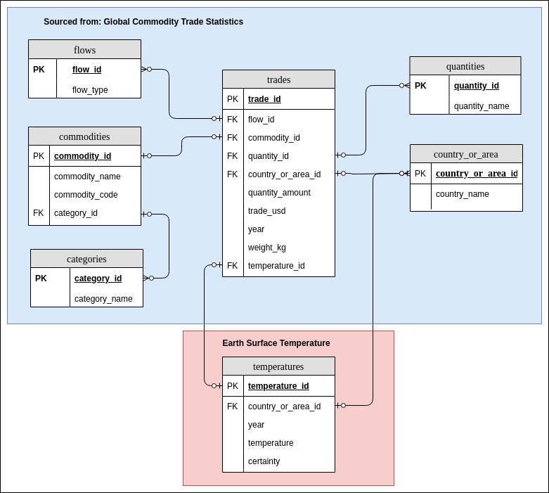

# Data Engineering Nanodegree - Capstone Project
## World Development - Database

## Intro

In the final project of the Data Engineering Nanodegree Udacity gave us the opportunity to select data sources for ourselves to build a data pipeline project.

I was interested in world development in terms of:
* trade
* climate change and ecological impact
* population and health
* food and nutrition
* education

I checked out datasets given in [research/_DataResearch.md](research/_DataResearch.md).
For the sake of a realistic scope I limited myself to datasets involved with trade and temperature development. 

## Datasets

This are the datasets that I chose to work with:
* Global Commodities and Trade Statistics of the United Nations (577.462 rows) [source](https://www.kaggle.com/unitednations/global-commodity-trade-statistics) and
* Climate Change: Earth Surface Temperature Data from NOAA (8.225.871 rows) [source](https://www.kaggle.com/berkeleyearth/climate-change-earth-surface-temperature-data)

In prepration for the staging tasks, I did expoloratory data analysis for, documented here:
* [Global Commodities and Trade Statistics](notebooks/Data Exploration - Global Commodity Trade Statistics.ipynb) and
* [ Climate Change: Earth Surface Temperature Data](notebooks/Data Exploration - Earth Surface Temperature Data.ipynb)

Basic results (column count, names, data types, numeric value ranges, string examples and missing value analysis) can be found here:
* [research/CommoditiesTrade.md](research/CommoditiesTrade.md)
* [research/Temperatures.md](research/Temperatures.md)

## Project Goal

The project goal is to create a joint data schema for the above selected datasets as well as a pipeline to import the data into it.
Possible use cases are: 
* Which countries where the hottest over the years?
* What is the top imported/exported commodity in by country and year
* Main commodity imported/exported by trade_usd for the hottest/coldest countries 

Some results using the finished database can be viewed here: [World Development Use Cases](notebooks/World Development Use Case.ipynb)

### Source files and location

The source data consists of two CSV files:
* commodity_trade_statistics_data.csv (1.1 GB) and
* GlobalTemperatures.csv (21.6 MB)

that have been uploaded to AWS S3 for access. 

## Project Scope

The raw data is downloaded from kaggle and uploaded to S3.
A airflow-powered data pipeline is used to ETL the data into a constellation schema.
Therefore data is staged - using Spark for the trades data and pandas for the temperature data.
Subsequently a common dimension table for country_and_area has been devised - partly by hand.
Next more dimensional tables and ultimately fact tables have been created automatically.

Finally a data quality check is used to check that data has been ETLed as expected.

The complete processes airflow DAG looks like this:



### Process description:

An airflow DAG orchestrates the whole process. It consists of the following steps:

1. *Begin_execution*: does nothing but indicating the start of the process.
2. *Recreate_db_schema*: (Re-)creates the target database constellation schema (executes DROP and CREATE SQL Statements) and the staging tables.
3. Staging (staging tables are not part of the final DB schema displayed below):
    1. *stage_commodities*: Staging of Global Temperatures (executes a PythonOperator using pandas) into commodities_staging table.
    2. *stage_temperatures*: Staging of Global Commodities and Trade Statistics (executes a BashOperator that executes a Spark Job on a standalone cluster in docker in client mode) into temperature_staging table.
4. Create a joint country_and_area and regions table from both sources (temperature and commodities) staging tables:
    1. *update_temperature_countries*: country_and_area labels in temperature_staging, according to [update_temperature_countries](airflow/dags/tasks/update_and_copy_countries.py), including rules like writing conjunctions in smaller case and 'Islands' instead of 'Isla' or 'Islds'.  
    2. *copy_temperature_countries*: copy country_and_area labels in temperature_staging: for country_or_area labels present in commodities_staging but not in temperature_staging, entries of the geographically closest country_or_area where copied and named according to the label of the country_or_area label in commodities_staging. A list can be found here: [copy_temperature_countries](airflow/dags/tasks/update_and_copy_countries.py).  
    3. *update_commodity_countries*: update country_and_area labels in temperature_staging, according to [update_commodity_countries](airflow/dags/tasks/update_and_copy_countries.py), including rules like writing 'Islands' instead of 'Isla' or 'Islds' or shortened country_or_area names (i.e. 'Bolivia (Plurinational State of)'  => 'Bolivia').
    4. *create_common_countries_table*: unify country_and_area labels of temperature_staging and commodities_staging and input its data into the dimensional country_and_area table. 
5. *Load_dim_<dim_table_name>* with dim_table_name in (flow, commodities, categories, quantities). Creating dimensional tables from staged global trade statistics. 
6. *Load_fact_temperatures_table*: Creates fact table 'temperatures' from temperature_staging and country_or_area table.
7. *Load_fact_trades_table*: Create fact table 'trades' from commodities_staging and dimensional tables (country_or_area, flow, commodities, categories, quantities) and fact table 'temperatures'.
8. *Check_data_quality*: Checks the number of records saved to the database by comparing these with expected values found in in dictionary [expected_table_counts](airflow/plugins/helpers/sql_queries.py).

The names in *cursiv* represent the task_ids of the tasks in the [world_dag.py](airflow/dags/world_dag.py) file. You can inspect these to see what (custom) operators and scripts have been used.

## Data schema

The resulting constellation schema (i.e. a snowflake schema with more than one facts table) looks like this:



### Content
* flows:  dimension table - indicates type of trade (import, export, re-import, re-export)
* commodities: dimension table - type of commodity that has been traded
* categories: dimension table - category of commodity type that has been traded (read: group of commodites)
* quantities: dimension table - weight, volume or length, no pieces etc.
* country_or_area: dimension table - consolidated countries table from stage_commodities and stage_temperature
* temperatures: facts table - provides average temperatures for year and country_or_area as well as average certainty of the measurement
* trades: facts table - provides commodities in the qu for year and country 

### Data dictionary

Legend:
PK = Primary Key
FK = Foreign Key

table: `flows`

Column    |  Type   |  PK  |  FK to table
----------|---------|------|------
flow_id   |   INT   | Yes
flow_type | VARCHAR

table: `commodities`

Column         |  Type   |  PK  |  FK to table
---------------|---------|------|------------
commodity_id   |   INT   | Yes
commodity_name | VARCHAR |
commodity_code | VARCHAR |
category_id    | VARCHAR |      | categories

table: `categories`

Column        | Type    | PK   | FK to table
--------------| ------- |------|------------
category_id   |   INT   | Yes
category_name | VARCHAR |

table: `quantities`

Column        | Type    | PK   | FK to table
--------------| ------- |------|------------
quantity_id   |   INT   | Yes
quantity_name | VARCHAR |

table: `country_or_area`

Column             | Type    | PK   | FK to table
-------------------| ------- |------|------------
country_or_area_id |   INT   | Yes
country_or_area    | VARCHAR |

table: `temperatures`

Column             | Type  | PK   | FK to table
-------------------| ----- |------|------------
temperature_id     |  INT  | Yes  |
country_or_area_id |  INT  |      | country_or_area
year               |  INT  |      |
temperature        | FLOAT |      |
certainty          | FLOAT |      |
rank               | FLOAT |      |

table: `trades`

Column             | Type    | PK   | FK to table
-------------------|---------|------|------------
trade_id           | INT     | Yes  |
flow_id            | INT     |      | flows 
commodity_id       | INT     |      | commodities
quantity_id        | INT     |      | quantities
country_or_area_id | INT     |      | country_or_area
ntity_amount       | FLOAT   |      |
quantity_amount    | FLOAT   |      |
trade_usd          | FLOAT   |      |
year               | INT     |      |
weight_kg          | INT     |      | 
temperature_id     | INT     |      | temperatures


# Tech Stack

You can find an outline of the current tech stack in the [docker-compose.yml](airflow/docker/docker-compose.yml)

The current setup consists of:
* **Apache Airflow** as pipeline orchestrator, run with a SequentialExecutor: 
  * a container (*webserver*) for the webservice: container is based on [puckel/docker-airflow](https://github.com/puckel/docker-airflow)_image, extend with info from this [medium article](https://medium.com/@thiagolcmelo/submitting-a-python-job-to-apache-spark-on-docker-b2bd19593a06), result can be found here: [Docker.airflow_spark](airflow/docker/Dockerfile.airflow_spark)
  * a container (*postgres*) for the configuration database: postgres:9.6
* **Apache Spark** as cluster computing framework, run as a stand-alone cluster:
  * a container (*spark-master*) for one master node: based on [bde2020/spark-master:2.4.4-hadoop2.7](https://hub.docker.com/r/bde2020/spark-master/builds)  image
  * a container (*spark-worker-1*) as worker node: based on [bde2020/spark-worker:2.4.4-hadoop2.7](https://hub.docker.com/r/bde2020/spark-worker/builds)
* **PostgreSQL** as data storage for staged and finally processed data in above described schema, a container based on docker image: postgres:10.10-alpine 
* **AWS S3** as file storage for the input data

I choose this stack, as I wanted to create a locally executable version of the whole project, that with some adaptations (i.e. move to kubernetes) could be run in the cloud as well, i.e. AWS EKS. 

# Scenarios

How would the current approach be changed if one of the following conditions materialized:

### 1. If the data was increased by 100x.

To remove bottlenecks at the staging step, the temperature_staging which is currently performed by a PythonOperator could be reformulated to a Spark Job.
As such it could be run like the commodities_staging.py already is.
In this project the Spark integration is using a stand-alone cluster with one master and one worker node. 
This could be extended by adding more worker nodes. For best performance also the [stage_commodities.py](airflow/docker/spark/scripts/stage_commodities.py) can be optimized.
And obviously if this was not enough to be run on a single machine based on the docker-compose.yml a kubernetes implementation could be built and run on AWS or GCP.  
Postgres could manage 100x (100 GB in this case). 
But in order to be highly available a multi-machine setup couldb be used. 
Also AWS Redshift could be used as Cloud alternative to easily be able to also work with 1000x data. 
This wouldn't be to hard to achieve: 
* An AWS Redshift cluster of appropriate size needed to be setup
* a new AWS connection needed to be defined in Airflow and 
* minor changes needed to be made to the operators and the SQL code to make it work with AWS Redshift capabilities. This could be:
  * change autoincrement from SERIAL to IDENTITY(1, 1)
  * adding dist_keys, sort_keys and 
  * distribution strategies 

### 2. If the pipelines were run on a daily basis by 7am.

As stated for scenario 1, we would need more parallelization for the Spark Jobs to achieve results readily.
Again for more processing power, more nodes and more machines could be used locally or in the cloud using Kubernetes instead of docker alone. 
Furthermore, in the staging phase, I would not move the data directly into the database, but into multiple files, e.g. in S3 or HDFS.
From there they could be loaded in a parallel fashion into the database and further processed in parallel on AWS Redshift.

### 3. If the database needed to be accessed by 100+ people.

Again, parallelization is key to meet this requirement. Using multiple machines and for smooth scaling the usage of a cloud provider would make best sense.


# How to

## Requirements:
* This tutorial assumes a Ubuntu installation (specifically: 18.04)
* Assumes pipenv

## Get code and setup basics:

Create your project folder and cd into it.
Now enter:

```
> git clone https://github.com/genughaben/world-development.git
> pipenv install
> pipenv shell
```

## Create and setup config.cfg

Copy and customize config values:
```
>  cp config_template.cfg config.cfg 
```

Now, customize values in the newly created config.cfg as required.
Primarily you need to add your AWS credentials to access S3.
  
NB: config.cfg is automatically excluded from git repo. If you should use another name, add it got .gitignore and update config variable usage across project.
  
  
## Execute ETL in docker

### airflow + target PostgreSQL in docker containers

#### Setup:
```
> docker build --rm --build-arg AIRFLOW_DEPS="datadog,dask" -t puckel/docker-airflow .
> docker build --rm --build-arg PYTHON_DEPS="flask_oauthlib>=0.9" -t puckel/docker-airflow .
```

#### Start Airflow, Spark and the target PostgreSQL DB with docker-compose:
```
> cd airflow/docker
> docker-compose up
```

After starging, you can reach airflows UI in your browser entering: localhost:8080/admin.


#### Configure airflow via UI:

Goto localhost:8080/admin
* Open Admin -> Connections
* Create new connection with clicking on "Create"
  
|Field    |Field value |
|---------|------------|
|Conn Id  | postgres   |
|Conn Type| Postgres   |
|Host     | db         |
|Schema   | world      |
|Login    | genughaben |
|Password | docker     |
|Port     | 5432       |

#### Running ETL Job:

* Switch on 'world_dag'
* Execute 'world_dag' by clicking on 'Trigger DAG'-button (first button in Links column)  


#### Stop airflow / spark / target db locally:
```
> docker-compose down
```

#### To re-start with re-initializing postgres databases enter:

```
> docker-compose down
> docker-compose up --force-recreate 
```


### Configuration and data inspection

#### Customize target PostgreSQL setup

* Update init.sql in local/script folder as you please


#### Enter PostgreSQL in docker container:

Make sure your docker-container is running
```
> docker exec -it local_db_1 bash
bash> psql -U genughaben -d world
```


# Development: Using local PostgreSQL DB and scripts - no Airflow usage

This section is for local development only. 
Only necessary in case you are interested in writing commodities data into the PostgreSQL DB on your local machine.

Prerequisits:
* Make sure you have a local installation of PostgreSQL and its running. See how-to here: [Development Utils](#development-utils)

### Pandas-based (very slow, potentially instable)

Login to Postgresql CLI and create a Database called 'dummy'. 

```
> sudo -u postgres psql

# Make sure your use as CreateDB rights
psql-cli> CREATE DATABASE dummy;
```

Now you can execute:
```
# create world Database and Tables
> python local-etl/create_table.py

# execute ETL:
> python local-etl/commodities-pandas-etl.py
```

### Spark-based

**NB: Only works if you have locally installed PySpark available!** 

```
> psql -U genughaben -d postgres

# Now create a Databse if you have not done so alread:
psql-cli> CREATE DATABASE dummy; 
```

If you have customized your config.cfg as required you can run:
```
> python local-etl/spark-etl
```
  
to execute the spark based etl script.

### Execute Spark Job inside docker container

First start the the container setup:

```
> cd airflow/docker
> docker-compose up
```
    
Submit Spark job from terminal outside docker:  
```
# First enter container:
>  docker exec -it local_spark_1 bash

# Next execute spark script like so:
> /spark/bin/spark-submit --master local[*] --driver-class-path spark/dependencies/postgresql-42.2.8.jar spark/scripts/stage_commodities.py
```

### Submit Spark Job from terminal to Spark in docker container

First start the the container setup:

```
> cd airflow/docker
> docker-compose up
```

In order to execute a Spark Job from your local terminal so that it runs in the docker container, you need the master nodes IP-Address.
You get it entering:

```
> docker ps
# find the ID (first column) of the spark-master container
> docker inspect <ID-of-spark-master-container>
```

You find the IP-Address on the bottom in: "Networks" => ... => "IPAddress"L <INPUT_SPARK_MASTER_CONTAINER_IP>

In airflow/docker/spark/local_container_spark_submit.sh substitute <INPUT_SPARK_MASTER_CONTAINER_IP> with the IP-Address.
Now execute:

```
> bash local_container_spark_submit.sh
```


# Development Utils

#### Install and setup Postgresql DB
```
> sudo apt-get install postgresql postgresql-contrib
```
Creating a role:
```
> sudo -u postgres psql
```

Create a Postgres user for airflow (still in psql console)

```
postgres=# CREATE USER <your-user-name> PASSWORD <your password>;
CREATE ROLE
postgres=# CREATE DATABASE <your-db-name>;
CREATE DATABASE
postgres=# GRANT ALL PRIVILEGES ON ALL TABLES IN SCHEMA public TO <your-user-name>;
GRANT
postgres=# \du
 List of roles
 Role name | Attributes | Member of
 — — — — — -+ — — — — — — — — — — — — — — — — — — — — — — — — — — — — — — + — — — — — -
 <your-user-name> | | {}
 postgres | Superuser, Create role, Create DB, Replication, Bypass RLS | {}
```

Add CREATE DB rights to <your-user-name>:
```
psql> ALTER USER <your-user-name> CREATEDB; 
```

Not exit console and check whether database is setup and can be accessed by user <your-user-name>

```
> psql -d airflow
psql (10.10 (Ubuntu 10.10-0ubuntu0.18.04.1))
Type "help" for help.
airflow=> \conninfo
```

You should see something like this:
```
You are connected to database "airflow" as user "<your-user-name> " via socket in "/var/run/postgresql" at port "5432".
airflow=>
```

#### Configure pg_hba.conf and postgresql.conf

##### pg_hba.conf
In order to allow airflow access to Postgres, pg_hba.conf needs to be configured:

```
> sudo nano /etc/postgresql/10/main/pg_hba.conf
```

Change int entry 'IPv4 local connections' the ADDRESS to 0.0.0.0/0 and the METHOD to trust.
In the end there should be:
```
# IPv4 local connections:
TYPE    DATABASE    USER    ADDRESS     METHOD
...
# IPv4 local connections                            <- replace line after this with next line
host    all         all     0.0.0.0/0   trust       <- use this line as replacement
```

You now need to restart Postgres entering:

```
> sudo service postgresql restart
```

##### postgresql.conf

Open postgresql.conf entering:

```
> sudo nano /etc/postgresql/10/main/postgresql.conf
```

Update in the section 'CONNECTIONS AND AUTHENTICATION' listen_addresses from 'localhost' to '*'
```
# — Connection Settings -
#listen_addresses = ‘localhost’     # what IP address(es) to listen on;           <-- before
listen_addresses  = ‘*’             # for Airflow connection                      <-- after
```

And restart Postgres again:
```
> sudo service postgresql restart
```

Based on https://medium.com/@taufiq_ibrahim/apache-airflow-installation-on-ubuntu-ddc087482c14  
Also helpful: https://medium.com/@srivathsankr7/apache-airflow-a-practical-guide-5164ff19d18b

Using local PostgreSQL for testing purposes
Enter CLI:
```
> sudo -u postgres psql 
```
  
Helpful commands:  
    
| command | comment |
|----------|-----------------|
|\du | show user|
|\l | displays list of databases|
| \c <database_name> | choose database for usage |
|\dt | show tables |
|\d <table_name> | show table schema|

Further reading: 
* https://blog.usejournal.com/testing-in-airflow-part-1-dag-validation-tests-dag-definition-tests-and-unit-tests-2aa94970570c
