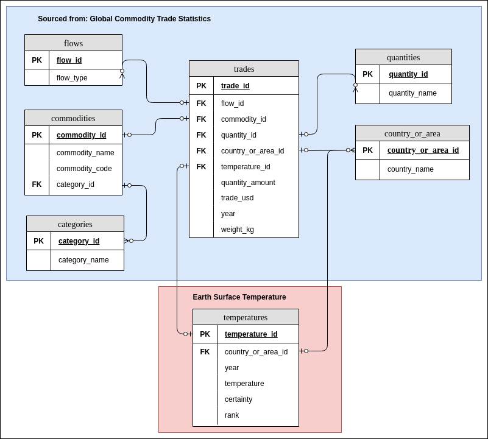

# Data Engineering Nanodegree - Capstone Project
## World Development - Database

## Intro

In the final project of the Data Engineering Nanodegree Udacity gave us the opportunity to select data sources for ourselves to build a data pipeline projecct.
I chose to work with trade and climage change data.

## Datasets and project goal

The goal of this project is to import data from the datasets:
* Global Commodities and Trade Statistics of the United Nations (577.462 rows) [source](https://www.kaggle.com/unitednations/global-commodity-trade-statistics) and
* Climate Change: Earth Surface Temperature Data from NOAA (8.225.871 rows) [source](https://www.kaggle.com/berkeleyearth/climate-change-earth-surface-temperature-data)

into a joint data schema.

### Source files and location

The source data consists of two CSV files:
* commodity_trade_statistics_data.csv (1.1 GB) and
* GlobalTemperatures.csv (21.6 MB)

that have been uploaded to AWS S3 for access. 

## Project Scope

The raw data is downloaded from kaggle and uploaded to S3.
A airflow-powered data pipeline is used to ETL the data into a constellation schema.
Therefore data is staged - using Spark for the trades data and pandas for the temperature data.
Subsequently a common dimension table for country_and_area has been devised - partly by hand.
Next more dimensional tables and ultimately fact tables have been created automatically.

Finally a data quality check is used to check that data has been ETLed as expected.

The complete processes airflow DAG looks like this:


### Process description:

An airflow DAG orchestrates the whole process. It consists of the following steps:

1. Begin execution ... (does nothing but indicating the start of the process)
2. (Re-)creates the target database constellation schema (executes DROP and CREATE SQL Statements) and the staging tables
3. Staging (staging tables are not part of the final DB schema displayed below)
    1. stage_commodities: Staging of Global Temperatures (executes a PythonOperator using pandas) into commodities_staging table
    2. stage_temperatures: Staging of Global Commodities and Trade Statistics (executes a BashOperator that executes a Spark Job on a standalone cluster in docker in client mode) into temperature_staging table
4. Create a joint countries and regions table from both sources staging tables:
    1. translate_country_labels: rename country_and_area labels in commodities_staging and temperature_staging to a common set (ignoring 3 areas given in the trades statistics, and copying entires of temperature_staging for country_or_area labels close by for which not data was available in temperature_staging but in commodities_staging) and to common rules (i.e. translate Isds. to Islands) 
    2. create_common_countries_table: unify country_and_area labels of both staging tables into one set and upload into the country_and_area table 
5. Create dimensional tables from staged global trade statistics (flow, commodities, categories, quantities)
6. Create facts table 'temperature' from staged global temperatures table and country_or_area table
7. Create facts table 'trades' from staged global trade statistics and dimensional tables (country_or_area, flow, commodities, categories, quantities) and facts table temperatures

## Tooling

THe following technologies where used in this projeccts that also have been part of the Nanodegrees programm:

* Amazon S3 for file storage
* PostgreSQL for data storage
* Apache Spark for data processing
* Apache Airflow for data orchestration

## Data schema

The resulting constellation schema (i.e. a snowflake schema with more than one facts table) looks like this:



### Content
* flows:  dimension table - indicates type of trade (import, export, re-import, re-export)
* commodities: dimension table - type of commodity that has been traded
* categories: dimension table - category of commodity type that has been traded (read: group of commodites)
* quantities: dimension table - weight, volume or length, no pieces etc.
* country_or_area: dimension table - consolidated countries table from stage_commodities and stage_temperature
* temperatures: facts table - provides average temperatures for year and country_or_area as well as average certainty of the measurement
* trades: facts table - provides commodities in the qu for year and country 

### Data dictionary

Legend:
PK = Primary Key
FK = Foreign Key

table: `flows`

Column    |  Type   |  PK  |  FK to table
----------|---------|------|------
flow_id   |   INT   | Yes
flow_type | VARCHAR

table: `commodities`

Column         |  Type   |  PK  |  FK to table
---------------|---------|------|------------
commodity_id   |   INT   | Yes
commodity_name | VARCHAR |
commodity_code | VARCHAR |
category_id    | VARCHAR |      | categories

table: `categories`

Column        | Type    | PK   | FK to table
--------------| ------- |------|------------
category_id   |   INT   | Yes
category_name | VARCHAR |

table: `quantities`

Column        | Type    | PK   | FK to table
--------------| ------- |------|------------
quantity_id   |   INT   | Yes
quantity_name | VARCHAR |

table: `country_or_area`

Column             | Type    | PK   | FK to table
-------------------| ------- |------|------------
country_or_area_id |   INT   | Yes
country_or_area    | VARCHAR |

table: `temperatures`

Column             | Type  | PK   | FK to table
-------------------| ----- |------|------------
temperature_id     |  INT  | Yes  |
country_or_area_id |  INT  |      | country_or_area
year               |  INT  |      |
temperature        | FLOAT |      |
certainty          | FLOAT |      |

table: `trades`

Column             | Type    | PK   | FK to table
-------------------|---------|------|------------
trade_id           | INT     | Yes  |
flow_id            | INT     |      | flows 
commodity_id       | INT     |      | commodities
quantity_id        | INT     |      | quantities
country_or_area_id | INT     |      | country_or_area
ntity_amount       | FLOAT   |      |
quantity_amount    | FLOAT   |      |
trade_usd          | FLOAT   |      |
year               | INT     |      |
weight_kg          | INT     |      | 
temperature_id     | INT     |      | temperatures


# Tech Stack

You can find an outline of the current tech stack in the [docker-compose.yml](airflow/docker/docker-compose.yml)

The current setup consists of:
* **Apache Airflow** as pipeline orchestrator, run with a SequentialExecutor (one container (*postgres*) for the webservice and one container (*webserver*) for the configuration database)
* **Apache Spark** as cluster computing framework, run as a stand-alone cluster (one container (*spark-master*) for one master node, one container (*spark-worker-1*) as worker node)
* **PostgreSQL** as target database where the final data schema and the data result
* **AWS S3** as storage for the input data

I choose this stack, as I wanted to create a locally executable version of the whole project, that with some adaptations (i.e. move to kubernetes) could be run in the cloud as well, i.e. AWS EKS. 

# Scenarios

How would the current approach be changed if one of the following conditions materialized:

### 1. If the data was increased by 100x.

To remove bottlenecks at the staging step, the temperature_staging which is currently performed by a PythonOperator could be reformulated to a Spark Job.
As such it could be run like the commodities_staging.py already is.
In this project the Spark integration is using a stand-alone cluster with one master and one worker node. 
This could be extended by adding more worker nodes. For best performance also the [stage_commodities.py](airflow/docker/spark/scripts/stage_commodities.py) can be optimized.
And obviously if this was not enough to be run on a single machine based on the docker-compose.yml a kubernetes implementation could be built and run on AWS or GCP.  
Postgres could manage 100x (100 GB in this case). 
But in order to be highly available a multi-machine setup couldb be used. 
Also AWS Redshift could be used as Cloud alternative to easily be able to also work with 1000x data. 
This wouldn't be to hard to achieve: 
* An AWS Redshift cluster of appropriate size needed to be setup
* a new AWS connection needed to be defined in Airflow and 
* minor changes needed to be made to the operators and the SQL code to make it work with AWS Redshift capabilities. This could be:
  * change autoincrement from SERIAL to IDENTITY(1, 1)
  * adding dist_keys, sort_keys and 
  * distribution strategies 

### 2. If the pipelines were run on a daily basis by 7am.

As stated for scenario 1, we would need more parallelization for the Spark Jobs to achieve results readily.
Again for more processing power, more nodes and more machines could be used locally or in the cloud using Kubernetes instead of docker alone. 
Furthermore, in the staging phase, I would not move the data directly into the database, but into multiple files, e.g. in S3 or HDFS.
From there they could be loaded in a parallel fashion into the database and further processed in parallel on AWS Redshift.

### 3. If the database needed to be accessed by 100+ people.

Again, parallelization is key to meet this requirement. Using multiple machines and for smooth scaling the usage of a cloud provider would make best sense.


# How to

## Requirements:
* This tutorial assumes a Ubuntu installation (specifically: 18.04)
* Assumes pipenv

## Get code and setup basics:

Create your project folder and cd into it.
Now enter:

```
> git clone https://github.com/genughaben/world-development.git
> pipenv install
> pipenv shell
```

## Create and setup config.cfg

Copy and customize config values:
```
>  cp config_template.cfg config.cfg 
```

Now, customize values in the newly created config.cfg as required.
Primarily you need to add your AWS credentials to access S3.
  
NB: config.cfg is automatically excluded from git repo. If you should use another name, add it got .gitignore and update config variable usage across project.
  
  
# Local ETL

## Local airflow + local target PostgreSQL in docker containers

### Setup:
```
> docker build --rm --build-arg AIRFLOW_DEPS="datadog,dask" -t puckel/docker-airflow .
> docker build --rm --build-arg PYTHON_DEPS="flask_oauthlib>=0.9" -t puckel/docker-airflow .
```

### Start airflow / spark / target db locally:
```
> cd airflow/local
> docker-compose -f docker-compose-LocalExecutor.yml up (--force-recreate - to reinit dbs after docker-compose ...  down)
```

### Stop airflow / spark / target db locally:
```
> docker-compose -f docker-compose-LocalExecutor.yml down
```

Now you can reach airflow in your browser entering: localhost:8080/admin.

**Sources:** Installation is based on [https://github.com/puckel/docker-airflow]

## Configure target PostgreSQL setup

* Update init.sql in local/script folder as you please
* Update requirements.txt as you please

## Enter PostgreSQL in docker container:

Make sure your docker-container is running
```
> docker exec -it local_db_1 bash
bash> psql -U postgres
```

## Configure airflow via UI:

Goto localhost:8080/admin
* Open Admin -> Connections
* Create new connection with clicking on "Create"
  
|Field    |Field value|
|---------|-----------|
|Conn Id  | postgres  |
|Conn Type| Postgres  |
|Host     | db        |
|Schema   | dummy     |
|Login    | postgres  |
|Password | postgres  |
|Port     | 5432      |


## DEVELOPMENT: SCRIPT BASED

Prerequisits:
* Make sure you have a local installation of PostgreSQL and its running. This means entering the following should not result in an error and open PostgreSQLs CLI:

### PANDAS BASED (very slow)

Login to postgresql CLI and create a Database called 'dummy'. 

```
> sudo -u postgres psql

# Make sure your use as CreateDB rights
psql-cli> CREATE DATABASE dummy;
```

Now you can execute:
```
# create world Database and Tables
> python local-etl/create_table.py

# execute ETL:
> python local-etl/pandas-etl.py
```

### SPARK BASED
```
> sudo -u postgres psql

# Now create a Databse if you have not done so alread:
psql-cli> CREATE DATABASE world; 
```

If you have customized your config.cfg as required you can run:
```
> python local-etl/spark-etl
```
  
to execute the spark based etl script.

### SPARK CONTAINER:
The spark container has its origin in the image of bde2020/spark-master:latest and is defined in   
docker-compose-LocalExecutor.yml
  
It uses spark_jars defined in /spark_jars  
and spark_scripts and config files in spark_scripts (mounted as volumes)  
  
Spark submit:  
```
# First enter container:
>  docker exec -it local_spark_1 bash

# Next execute spark script like so:
> /spark/bin/spark-submit --master local[*] --driver-class-path /spark_jars/postgresql-42.2.8.jar /simple-app/stage_commodities.py
```


# Development Utils

#### Install and setup Postgresql DB
```
> sudo apt-get install postgresql postgresql-contrib
```
Creating a role:
```
> sudo -u postgres psql
```

Create a Postgres user for airflow (still in psql console)

```
postgres=# CREATE USER <your-user-name> PASSWORD <your password>;
CREATE ROLE
postgres=# CREATE DATABASE <your-db-name>;
CREATE DATABASE
postgres=# GRANT ALL PRIVILEGES ON ALL TABLES IN SCHEMA public TO <your-user-name>;
GRANT
postgres=# \du
 List of roles
 Role name | Attributes | Member of
 — — — — — -+ — — — — — — — — — — — — — — — — — — — — — — — — — — — — — — + — — — — — -
 <your-user-name> | | {}
 postgres | Superuser, Create role, Create DB, Replication, Bypass RLS | {}
```

Add CREATE DB rights to <your-user-name>:
```
psql> ALTER USER <your-user-name> CREATEDB; 
```

Not exit console and check whether database is setup and can be accessed by user <your-user-name>

```
> psql -d airflow
psql (10.10 (Ubuntu 10.10-0ubuntu0.18.04.1))
Type "help" for help.
airflow=> \conninfo
```

You should see something like this:
```
You are connected to database "airflow" as user "<your-user-name> " via socket in "/var/run/postgresql" at port "5432".
airflow=>
```

#### Configure pg_hba.conf and postgresql.conf

##### pg_hba.conf
In order to allow airflow access to Postgres, pg_hba.conf needs to be configured:

```
> sudo nano /etc/postgresql/10/main/pg_hba.conf
```

Change int entry 'IPv4 local connections' the ADDRESS to 0.0.0.0/0 and the METHOD to trust.
In the end there should be:
```
# IPv4 local connections:
TYPE    DATABASE    USER    ADDRESS     METHOD
...
# IPv4 local connections                            <- replace line after this with next line
host    all         all     0.0.0.0/0   trust       <- use this line as replacement
```

You now need to restart Postgres entering:

```
> sudo service postgresql restart
```

##### postgresql.conf

Open postgresql.conf entering:

```
> sudo nano /etc/postgresql/10/main/postgresql.conf
```

Update in the section 'CONNECTIONS AND AUTHENTICATION' listen_addresses from 'localhost' to '*'
```
# — Connection Settings -
#listen_addresses = ‘localhost’     # what IP address(es) to listen on;           <-- before
listen_addresses  = ‘*’             # for Airflow connection                      <-- after
```

And restart Postgres again:
```
> sudo service postgresql restart
```

Based on https://medium.com/@taufiq_ibrahim/apache-airflow-installation-on-ubuntu-ddc087482c14  
Also helpful: https://medium.com/@srivathsankr7/apache-airflow-a-practical-guide-5164ff19d18b

Using local PostgreSQL for testing purposes
Enter CLI:
```
> sudo -u postgres psql 
```
  
Helpful commands:  
    
| command | comment |
|----------|-----------------|
|\du | show user|
|\l | displays list of databases|
| \c <database_name> | choose database for usage |
|\dt | show tables |
|\d <table_name> | show table schema|


Further reading: 
* https://blog.usejournal.com/testing-in-airflow-part-1-dag-validation-tests-dag-definition-tests-and-unit-tests-2aa94970570c
